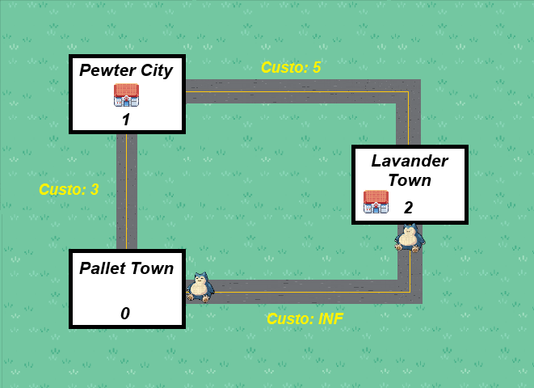

# Grafo de Teste



## Caso de Teste

```
3
2
1
Pallet Town
0
Pewter City
1
Lavender Town
1
0 1 3
1 2 5
3
0
3
1
4
Pikachu
Eletrico
5
3
4
Charmander
Fogo
7
9
4
Mewtwo
Psiquico
25
30
4
Pidgey
Voador
40
50
4
Squirtle
Agua
6
9
4
Fuecoco
Fogo
3
2
4
Abra
Psiquico
7
8
5
6
Pidgey
5
7
Mewtwo
8
9
Fogo
9
Voador
10
0
0
11
0
0

```
#